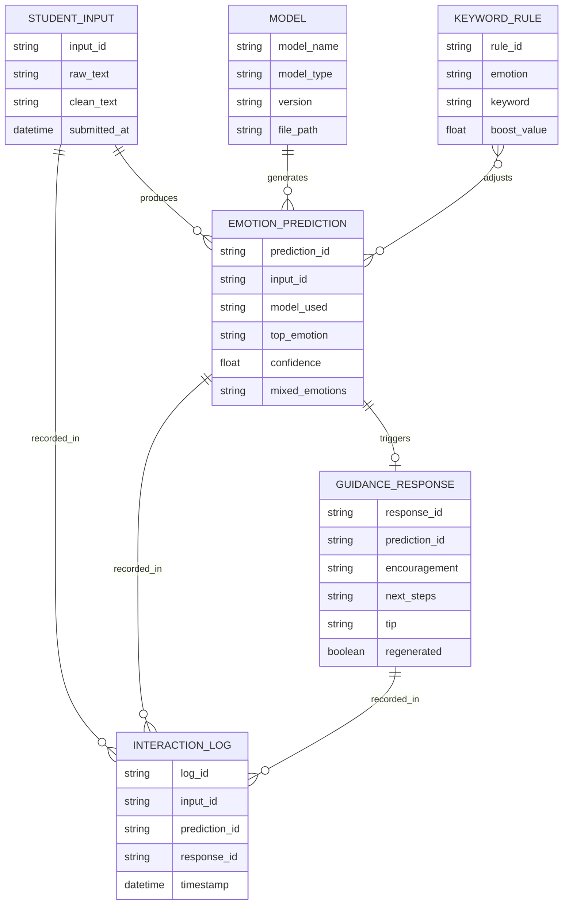

# AI-Driven Emotion Detection & Personalized Learning Support Platform

End-to-end system: student free text → emotion prediction (BiLSTM + BERT + keyword rules) → Gemini-generated guidance → Streamlit UI → CSV logging → analytics dashboard.

---

## 1. Entity Relationship (ER) Diagram



In the implementation, `STUDENT_INPUT` + `EMOTION_PREDICTION` + `GUIDANCE_RESPONSE` are flattened into one row of `logs/interactions.csv` for simplicity — the diagram above shows the logical structure your report/ERD slide should present.

---

## 2. Pre-requisites

- Python 3.10+
- pip / virtualenv
- (Optional but recommended) A GPU for BERT fine-tuning — CPU works for BiLSTM and small BERT runs
- A Kaggle account + dataset with **text + emotion label** columns (see Epic 2)
- A **Gemini API key** (https://aistudio.google.com/apikey) for live AI guidance — the app works without it too, using fallback templates

Install everything:
```bash
cd emotion_learning_assistant
pip install -r requirements.txt
export GEMINI_API_KEY="your_key_here"      # optional, enables live guidance
```

---

## 3. Project Flow

```
Raw student text
      │
      ▼
Text cleaning (data_prep.py)
      │
      ▼
 ┌───────────────┬───────────────┐
 │  BiLSTM model │   BERT model  │   (Epic 2 training, Epic 3 inference)
 └───────────────┴───────────────┘
      │
      ▼
Keyword rule boosting (keyword_rules.py)     — Epic 3
      │
      ▼
Final emotion distribution + mixed-emotion breakdown
      │
      ▼
Gemini guidance generation (gemini_guidance.py)  — Epic 4
      │
      ▼
Streamlit UI: charts + guidance + regenerate button  — Epic 5
      │
      ▼
CSV interaction log (logger.py) → Analytics dashboard  — Epic 6
```

---

## 4. Epic-by-Epic Completion Guide

### Epic 1 — Environment Setup and Dependency Configuration
1. `pip install -r requirements.txt`
2. Set `GEMINI_API_KEY` as an environment variable (or put it in a `.env` and load with `python-dotenv`).
3. Confirm folders exist: `data/`, `models/`, `logs/` (already created).
4. Sanity check: `python src/data_prep.py` — should print row counts from the bundled `sample_emotions.csv`.

### Epic 2 — Kaggle Model Training and Integration
1. Download a Kaggle emotion-text dataset (e.g. a student-sentiment or general emotion-text dataset). Make sure it has a text column and a label column.
2. Save it as `data/raw_emotions.csv` with columns `text,emotion`. If your Kaggle labels differ (e.g. "anger", "boredom"), add mappings in `EMOTION_MAP` inside `src/data_prep.py` — a few are pre-filled.
3. Train BiLSTM: `python src/train_bilstm.py` → saves to `models/bilstm_emotion.h5`.
4. Train BERT: `python src/train_bert.py` → saves to `models/bert_emotion/`.
5. Note the validation accuracy printed at the end of each — you'll want this for your report / dual-model comparison slide.

### Epic 3 — Core Emotion Detection Pipeline Development
1. Already implemented in `src/emotion_pipeline.py` (`EmotionDetector`) and `src/keyword_rules.py`.
2. Test it directly: `python src/emotion_pipeline.py`.
3. Tune `MIXED_EMOTION_THRESHOLD` in `config.py` if mixed-emotion output feels too sparse/noisy.
4. Optional enhancement: expand `KEYWORD_LEXICON` in `keyword_rules.py` with domain-specific phrases from your own dataset.

### Epic 4 — AI-Powered Guidance & Regeneration Engine
1. Implemented in `src/gemini_guidance.py`.
2. With `GEMINI_API_KEY` set, it calls Gemini with a structured prompt (Encouragement / Next Steps / Tip).
3. Without a key, it uses the `FALLBACK_TEMPLATES` dict so the app still runs end-to-end — good for a demo without API costs.
4. "Regenerate" simply re-calls with a higher temperature for variation — wired to the button in the Streamlit app.

### Epic 5 — Streamlit UI Implementation
1. Implemented in `app.py`.
2. Run it: `streamlit run app.py`
3. Features included: text input, model selector (BiLSTM / BERT / Compare Both), keyword-rule toggle, emotion bar chart(s), mixed-emotion display, AI guidance panel with regenerate button.

### Epic 6 — User Interaction (logging + analytics)
1. Implemented in `src/logger.py` — every analyzed submission is appended to `logs/interactions.csv`.
2. The "📊 Analytics Dashboard" tab in `app.py` reads that CSV and shows:
   - Emotion distribution pie chart
   - Emotion trend over time (line chart)
   - Model usage bar chart
   - Recent interaction table
3. This log is also your "continuous learning" data source — you can periodically retrain models on real logged + corrected labels.

---

## 5. Conclusion / Wrap-up Checklist for Today

- [ ] Epic 1: dependencies installed, folders in place, env var set
- [ ] Epic 2: dataset loaded, both models trained, accuracy noted
- [ ] Epic 3: pipeline tested standalone, keyword rules tuned
- [ ] Epic 4: Gemini guidance tested (or fallback confirmed working)
- [ ] Epic 5: Streamlit app runs, both models selectable, charts render
- [ ] Epic 6: a few test interactions logged, dashboard tab shows charts
- [ ] Take screenshots of the running app for your report/demo
- [ ] Write up the ER diagram + project flow (above) into your submission doc/slides

### Quick end-to-end test (no Kaggle download needed)
The bundled `data/sample_emotions.csv` lets you run the *entire* pipeline right now to confirm wiring before plugging in the real dataset:
```bash
python src/train_bilstm.py     # trains on the sample set (fast, small)
streamlit run app.py            # try the full app immediately
```
Then swap in the real Kaggle dataset at `data/raw_emotions.csv` and retrain for your final submission.
